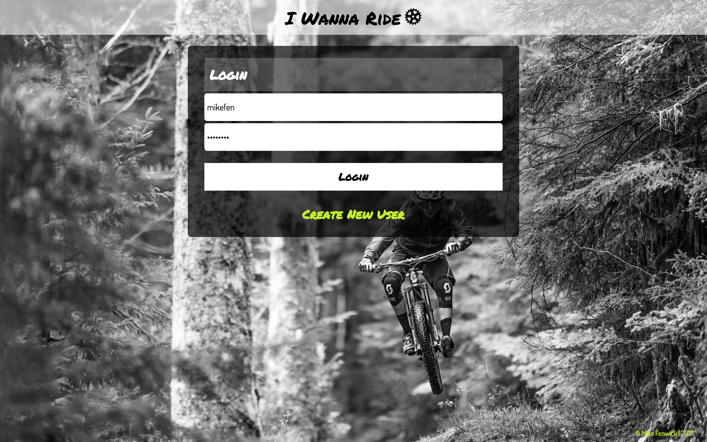
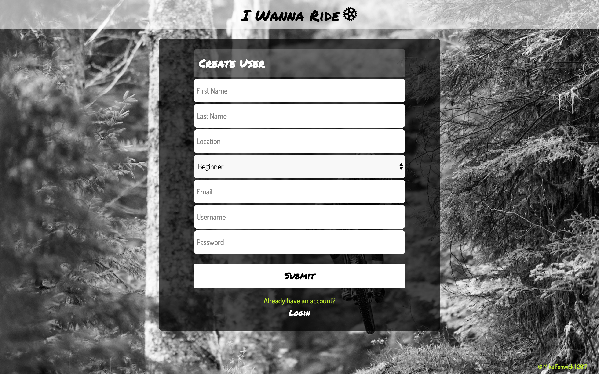
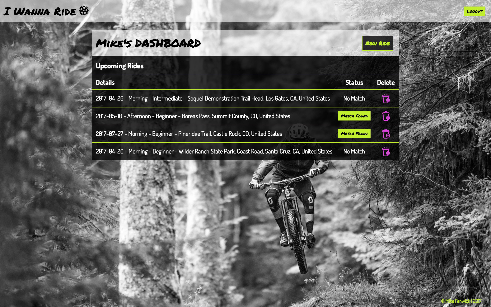
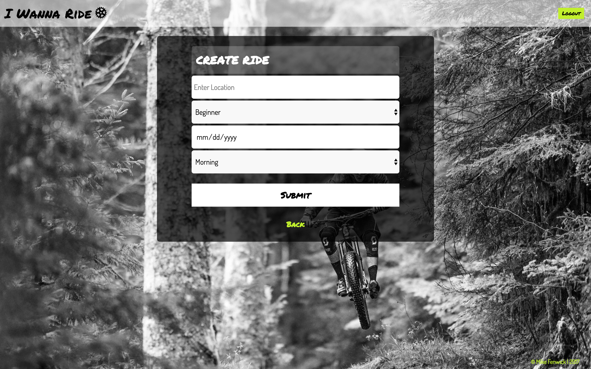
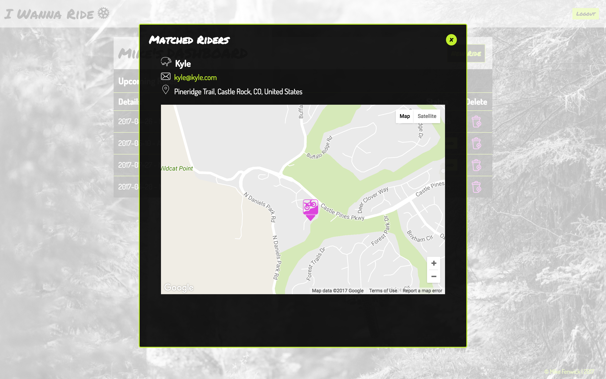

## I Wanna Ride

## Website Details

[I Wanna Ride](https://i-wanna-ride.herokuapp.com/)
* **Default Username** - mikefen
* **Default Password** - password

## Project Status

Project is currently under development. Current functionality is;

* User login (Not secure as of yet)
* Fetch user details from API and sign user in
* Display a dashboard of current users upcoming rides
* Check system for matched rides and display rider matched button to dashboard if match is found
* Ability to click on matched ride button to display details of that ride and user you're matched with
* Ability to delete rides from system
* Ability to create a new ride
* Ability for user logout
* Ability for create new user

Upcoming features;

* Secure login
* Edit user profile
* Add user image to profile
* Add gender to profile
* Allow matches based on gender
* Alter the format of the input date
* Match rides by radius instead of exact location match
* Detect when a ride date has passed and move it into a past rides section
* Ride rating system
* Pull in trail information
* Allow users to flag preferred trails search user database for riders who ride the same preferred trails and contact them directly.
* Add more activities like skiing, running, rock climbing, road cycling

## Project Screen Shot(s)

   
   
   
   
   
   

## Installation and Setup Instructions

* `git clone`
* `create db` - if you don't have postgresSQl go install it here: http://postgresapp.com/
* Follow the installation instructions for postgresSQl from website
* Start postgresSQl server
* `npm install`
* `npm start`

## Reflection
  - **I used SCSS, ES6, webpack, React, Redux, React Router, Node, Express JS and SQL which allowed my to build the application that I first envisioned.**
  - This project was a personal driven project and our final project for Module 3 at Turing School
  - I set out to build an application to match mountain bike riders who want to ride a trail but don't want to ride it alone. The app allows users to add the date, time and location where they want to ride and will then check the system for other riders with matching details.
  - This project was only my second experience with Redux so I was still a bit unsure of the whole Redux cycle. I also decided to create my own backend using Node, Express and SQL after a brief introduction. Creating my own backend database was a challenge that I enjoyed and something that I look forward to working on again.
  - What were some unexpected obstacles?
      - The initial set up of webpack was a bit challenging.  
  - What tools did you use to implement this project?
      - I wanted to become more comfortable with webpack and building out my own backend db therefore I decided to build my own project from the start versus using create-react-app.
      - Although not really needed on a project of this size, I decide to use Redux, again to just become more familiar with this framework
      - I also chose to use SCSS over CSS to gain more practice and be able to utilize mixins and variables.

## Resources
  - NPM packages used within this project
    - google-map-react
    - react-geosuggest
    - react-modal
